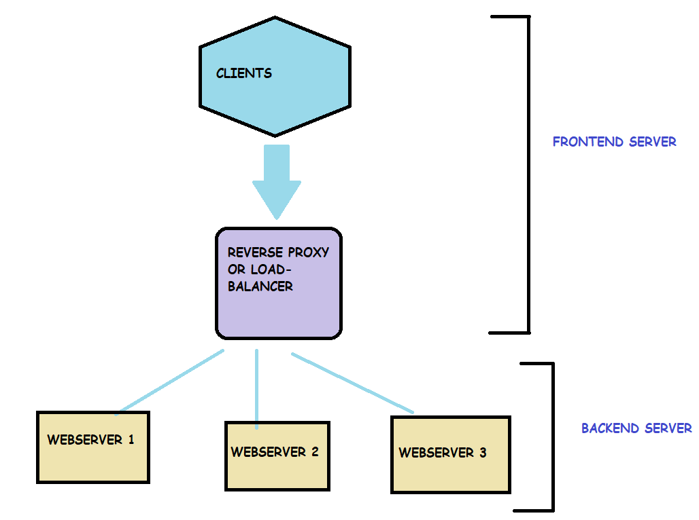

## 🔰 HAProxy-and-Load-Balancer 🔰
### Configuration of HAProxy and Load-Balancer using Ansible

HAProxy is free, open source software that provides a high availability load balancer and proxy server for TCP and HTTP-based applications that spreads requests across multiple servers and Ansible is an automation tool used for configuration management.

FRONTEND SERVER --> Reverse proxy + client

BACKEND SERVER --> all the webservers

This ansible playbook is dynamic, which means you just need to add the web-server IPs in the inventory file and ansible will automatically configure everything.

### How to run the playbook?

- Clone this repo.
- cd to the location where you've cloned the repo.
- Add the web-server IPs in the inventory file of ansible.
- Run the command - "ansible-playbook load-balancer.yml".
